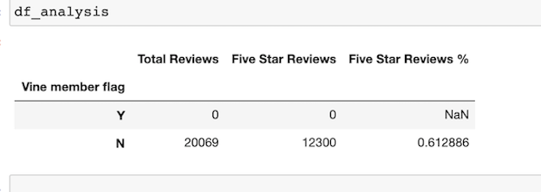

# Amazon_Vine_Analysis

We will analyze reviews of us Videos dataset from Amazon Vine program.
Amazon reviews written by members of the paid Amazon Vine program. The Amazon Vine program is a service that allows manufacturers and publishers to receive reviews for their products. Companies like SellBy pay a small fee to Amazon and provide products to Amazon Vine members, who are then required to publish a review.

We use PySpark to perform the ETL process to extract the dataset, transform the data, connect to an AWS RDS instance, and load the transformed data into pgAdmin. We then use Pandas to determine if there is any bias towards favorable reviews from Vine members in the dataset.

For the analsyis we used the below variables from our videos dataset:

We then peform the following transforms to the dataframe:
- Select only the records where the total votes was equal or greater than 20
- From step 1 choose only the records where percentage of helpful votes is equal or greater than 50%.
- Calculate the total number of reviews, the number of 5-star reviews and the percentage of 5-star reviews for each member type

We notice that there are only non vine numbers .

And more than 60% of the non vine member reviews' are FiveStar. According to the result ,there id no positivity bias in the vine program.

